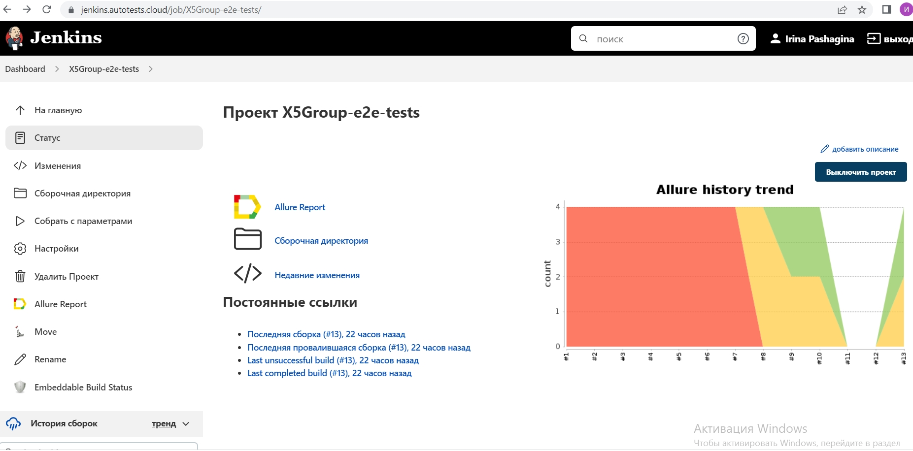
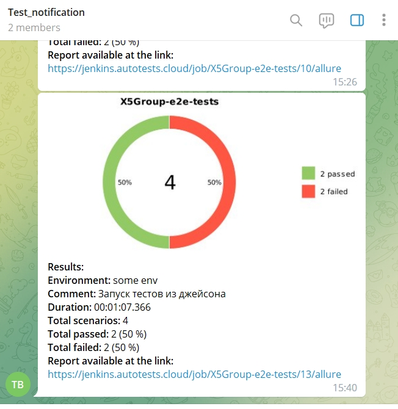

# Проект по автоматизации тестирования X5 Group

## :pushpin: Содержание:

- [Технологии и инструменты](#earth_africa-технологии-и-инструменты)
- [Реализованные проверки](#earth_africa-Реализованные-проверки)
- [Сборка в Jenkins](#earth_africa-Jenkins-job)
- [Запуск из терминала](#earth_africa-Запуск-тестов-из-терминала)
- [Allure отчет](#earth_africa-Allure-отчет)
- [Интеграция с Allure TestOps](#earth_africa-Интеграция-с-Allure-TestOps)
- [Интеграция с Jira](#earth_africa-Интеграция-с-Jira)
- [Отчет в Telegram](#earth_africa-Уведомление-в-Telegram-при-помощи-бота)
- [Видео примеры прохождения тестов](#earth_africa-Примеры-видео-о-прохождении-тестов)

## :rocket: Технологии и инструменты

<p align="center">
<a href="https://www.jetbrains.com/idea/"></a>
<a href="https://www.java.com/"></a>
<a href="https://github.com/"></a>
<a href="https://junit.org/junit5/"></a>
<a href="https://gradle.org/"></a>
<a href="https://selenide.org/"></a>
<a href="https://aerokube.com/selenoid/"></a>
<a href="https://github.com/allure-framework/allure2"></a>
<a href="https://www.jenkins.io/"></a>
</p>

## :scroll: Реализованные проверки

- ✓ Проверка смены языка.
- ✓ Проверка появления меню второго уровня.
- ✓ Проверка лога консоли на наличие ошибок.

## </a> Jenkins job

<a target="_blank" href="https://jenkins.autotests.cloud/job/X5Group-e2e-tests/">Сборка в Jenkins</a>
<p align="center">
<a href="https://jenkins.autotests.cloud/job/X5Group-e2e-tests/"></a>
</p>

### Параметры сборки в Jenkins:

* browser (default chrome)
* browserVersion (default 89.0)
* browserSize (default 1920x1080)
* browserMobileView (mobile device name, for example iPhone X)
* remoteDriverUrl (url address from selenoid or grid)
* videoStorage (url address where you should get video)
* threads (number of threads)

## :computer: Запуск тестов из терминала

```bash
gradle clean test
```

## Удаленный запуск:

```bash
clean
test
-Dbrowser=${BROWSER}
-DbrowserVersion=${BROWSER_VERSION}
-DbrowserSize=${BROWSER_SIZE}
-DbrowserMobileView="${BROWSER_MOBILE}"
-DremoteDriverUrl=https://user1:1234@${REMOTE_DRIVER_URL}/wd/hub/
-DvideoStorage=https://${REMOTE_DRIVER_URL}/video/
-Dthreads=${THREADS}
```

## </a> Уведомление в Telegram при помощи бота

<p align="center">

</p>